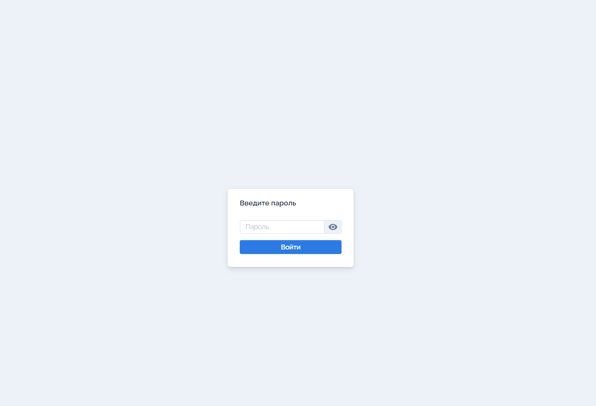

# Запуск проекта в на своей локальной машине 

# 📝 To-Do App

Простой и удобный сервер для управления задачами, написанный на Go с использованием чистой архитектуры, JWT-авторизации и SQLite.

---

## 🚀 Быстрый старт

### 1. Сделать pull из docker hub
Введите команду в терминале 
```bash
docker pull ivan202/todo-server:v1
```
### 2. Проверьте что образ есть на вашей локальной машине
Для этого введите команду:
```bash
docker images
```
После данной команды должно вывестись:
```bash 
REPOSITORY            TAG       IMAGE ID       CREATED         SIZE
ivan202/todo-server   v1        948235597752   3 minutes ago   1.97GB
```

### 3. Запустите приложение 
⚠️API по умолчанию работает на порту 7540

При указании проброса поротов вы можете указать порт который вам удобен. То есть после флага -p your_port:7540

По умолчанию можете ввести команду:
```bash
docker run -d -p 7540:7540 --name cont-todo --rm ivan202/todo-server:v1
```
### 4. Проверьте работу контейнера 
Для этого введите:
```bash
docker ps
```
Вывод примерно будет таким, за исключением CONTAINER ID
```bash
CONTAINER ID   IMAGE                    COMMAND           CREATED              STATUS              PORTS                    NAMES
099e791daa47   ivan202/todo-server:v1   "./todo-server"   About a minute ago   Up About a minute   0.0.0.0:7540->7540/tcp   cont-todo
```
✅После успешной проверки подключайтесь к API через URL 

URL для корректного подключения к API серверу 
```bash
http://localhost:yout_port/login.html
```

### 5. Окошко с вводом пароля 


🔐Пароль - 12345678
### ⚙️ Используемые технологии
Go 1.20+

SQLite — простая встраиваемая база данных

JWT — безопасная авторизация с использованием токенов

http.Cookie — хранение токена в куках

godotenv — работа с .env файлом

Чистая архитектура — разделение на слои: хендлеры, сервисы, модели, утилиты

### 📌 Возможности
✅ Регистрация с паролем

🔐 Авторизация через JWT 

📥 Создание, обновление, удаление задач

🔍 Поиск задач по дате или названию

🔁 Повторяющиеся задачи с автоматическим переносом даты

📦 Поддержка REST API
